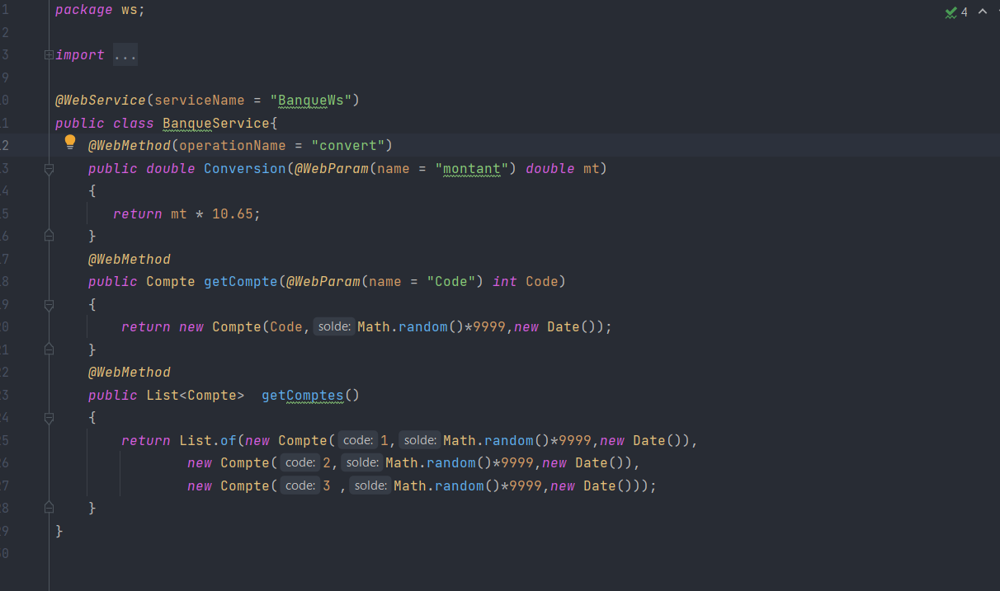
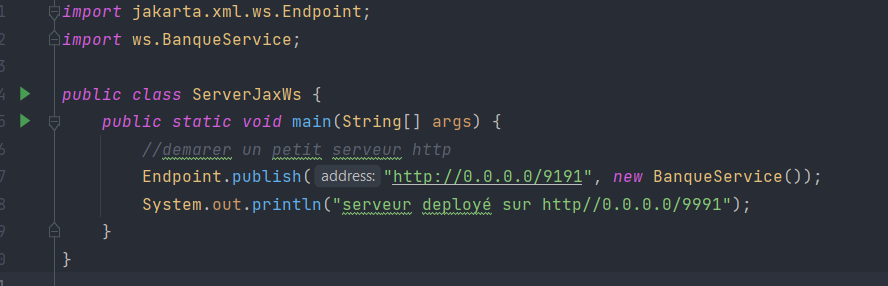
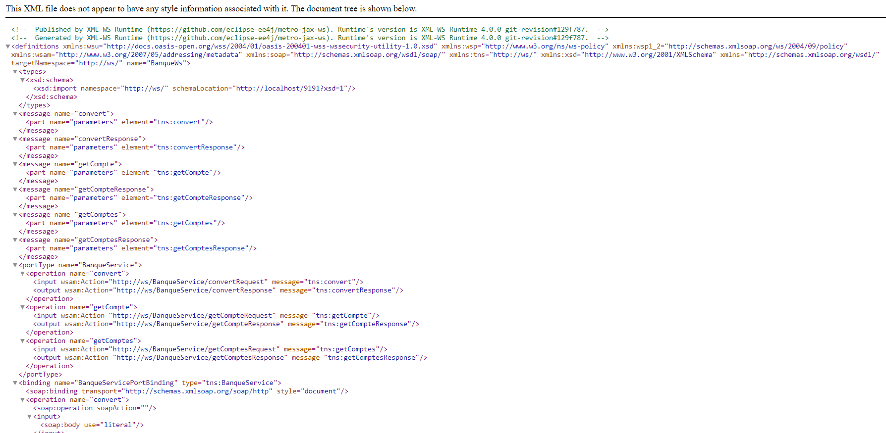
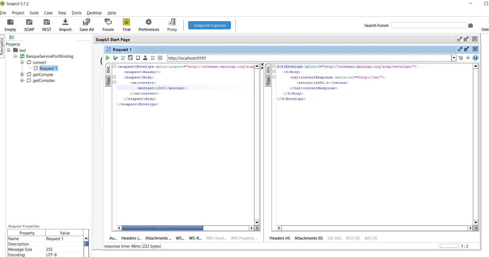
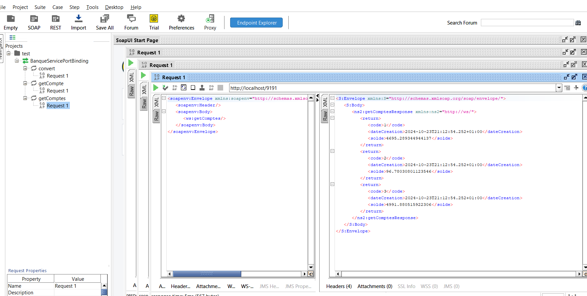
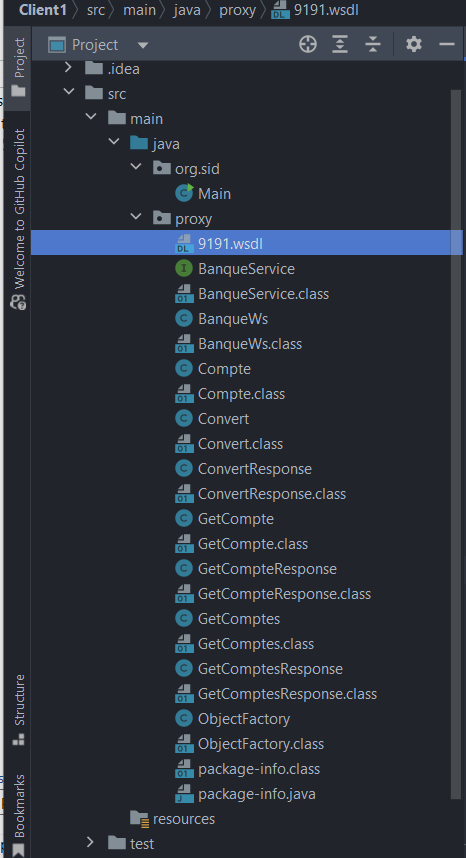
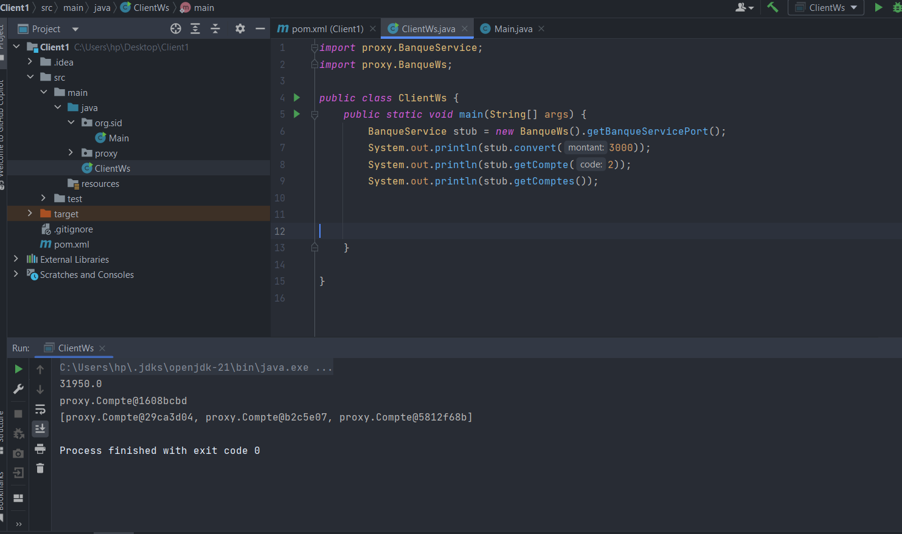

<h1>Activité Pratique N°1 - Web Services SOAP WSDL</h1>

<h2>Introduction</h2>

Dans cette activité pratique, nous avons implémenté un service web SOAP en utilisant <strong>WSDL</strong> pour la description du service. SOAP (Simple Object Access Protocol) est un protocole de communication utilisé pour échanger des informations structurées dans un environnement décentralisé et distribué.

<h2>Objectifs</h2>
    <ul>
        <li>Créer un service web SOAP.</li>
        <li>Générer un fichier WSDL pour la description du service.</li>
        <li>Tester le service web avec un client SOAP.</li>
        <li>Comprendre l'utilisation des middlewares dans la gestion des requêtes SOAP.</li>
    </ul>

<h2>Étapes de l'implémentation</h2>

<h3>1. Création du Service Web</h3>

La première étape a consisté à créer le service web. Le fichier suivant montre la création du service :

<h3>2. Mise en place du serveur</h3>
    
Ensuite, nous avons configuré un serveur pour héberger le service. Ci-dessous un aperçu de cette configuration :

    
 <h3>3. Fichier WSDL</h3>
    
Le fichier WSDL a été généré automatiquement, permettant la description du service web et facilitant l'interopérabilité :

    

<h3>4. Test du service SOAP</h3>
    
Nous avons testé le service web SOAP en envoyant des requêtes et en observant les réponses. Les captures d'écran suivantes montrent les résultats :

    
    
 <h3>5. Génération de la classe Java</h3>
    
Une classe a été générée automatiquement à partir du fichier WSDL pour l'interaction avec le service SOAP :

    

<h3>6. Middleware</h3>
    
Enfin, nous avons implémenté un middleware pour gérer les requêtes et réponses SOAP :

    